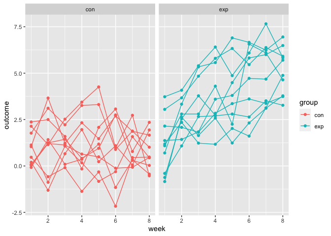

P8105 HW5 \| Jagjit Singh \| UNI: JS5958
================

``` r
library(tidyverse)
```

    ## ── Attaching packages ─────────────────────────────────────── tidyverse 1.3.2 ──
    ## ✔ ggplot2 3.3.6      ✔ purrr   0.3.5 
    ## ✔ tibble  3.1.8      ✔ dplyr   1.0.10
    ## ✔ tidyr   1.2.1      ✔ stringr 1.4.1 
    ## ✔ readr   2.1.3      ✔ forcats 0.5.2 
    ## ── Conflicts ────────────────────────────────────────── tidyverse_conflicts() ──
    ## ✖ dplyr::filter() masks stats::filter()
    ## ✖ dplyr::lag()    masks stats::lag()

``` r
library(viridis)
```

    ## Loading required package: viridisLite

# Problem 1

The code chunk below imports the data in individual spreadsheets
contained in `./data/zip_data/`. To do this, I create a dataframe that
includes the list of all files in that directory and the complete path
to each file. As a next step, I `map` over paths and import data using
the `read_csv` function. Finally, I `unnest` the result of `map`.

``` r
full_df = 
  tibble(
    files = list.files("./q1_data/"),
    path = str_c("./q1_data/", files)
  ) %>% 
  mutate(data = map(path, read_csv)) %>% 
  unnest()
```

The result of the previous code chunk isn’t tidy – data are wide rather
than long, and some important variables are included as parts of others.
The code chunk below tides the data using string manipulations on the
file, converting from wide to long, and selecting relevant variables.

``` r
tidy_df = 
  full_df %>% 
  mutate(
    files = str_replace(files, ".csv", ""),
    group = str_sub(files, 1, 3)) %>% 
  pivot_longer(
    week_1:week_8,
    names_to = "week",
    values_to = "outcome",
    names_prefix = "week_") %>% 
  mutate(week = as.numeric(week)) %>% 
  select(group, subj = files, week, outcome)
```

Finally, the code chunk below creates a plot showing individual data,
faceted by group.

``` r
tidy_df %>% 
  ggplot(aes(x = week, y = outcome, group = subj, color = group)) + 
  geom_point() + 
  geom_path() + 
  facet_grid(~group)
```

<!-- -->

This plot suggests high within-subject correlation – subjects who start
above average end up above average, and those that start below average
end up below average. Subjects in the control group generally don’t
change over time, but those in the experiment group increase their
outcome in a roughly linear way.

# Problem 2

Below we create a city_state variable (e.g. “Baltimore, MD”) and then
summarize within cities to obtain the total number of homicides and the
number of unsolved homicides (those for which the disposition is “Closed
without arrest” or “Open/No arrest”):

``` r
df = read.csv("./q2_data/homicide-data.csv")
homicide_df = df %>% 
  mutate(
    city_state = str_c(city, ', ', state),
    resolution = case_when(
      disposition =="Closed by arrest" ~ "solved",
      disposition =="Closed without arrest" ~ "unsolved",
      disposition =="Open/No arrest" ~"unsolved"
         )) %>% 
  relocate(city_state)


summary_city_df =
  homicide_df %>%
  group_by(city) %>%
  summarize(
    unsolved = sum(resolution == "unsolved"),
    solved = sum(resolution == "solved"),
    total = n()
    )

summary_city_df
```

    ## # A tibble: 50 × 4
    ##    city        unsolved solved total
    ##    <chr>          <int>  <int> <int>
    ##  1 Albuquerque      146    232   378
    ##  2 Atlanta          373    600   973
    ##  3 Baltimore       1825   1002  2827
    ##  4 Baton Rouge      196    228   424
    ##  5 Birmingham       347    453   800
    ##  6 Boston           310    304   614
    ##  7 Buffalo          319    202   521
    ##  8 Charlotte        206    481   687
    ##  9 Chicago         4073   1462  5535
    ## 10 Cincinnati       309    385   694
    ## # … with 40 more rows

Now for the city of Baltimore, MD, we use the prop.test function to
estimate the proportion of homicides that are unsolved; save the output
of prop.test as an R object, apply the broom::tidy to this object and
pull the estimated proportion and confidence intervals from the
resulting tidy dataframe:

``` r
baltimore_df = 
  homicide_df %>% 
  filter(city_state == "Baltimore, MD") %>%
  summarize(
    unsolved = sum(resolution == "unsolved"),
    n = n()) 

statistics_df =
  prop.test(
    x = baltimore_df  %>% pull(unsolved),
    n = baltimore_df  %>% pull(n)) 

statistics_df %>% 
  broom::tidy()
```

    ## # A tibble: 1 × 8
    ##   estimate statistic  p.value parameter conf.low conf.high method        alter…¹
    ##      <dbl>     <dbl>    <dbl>     <int>    <dbl>     <dbl> <chr>         <chr>  
    ## 1    0.646      239. 6.46e-54         1    0.628     0.663 1-sample pro… two.si…
    ## # … with abbreviated variable name ¹​alternative

Now we run prop.test for each of the cities in the dataset, and extract
both the proportion of unsolved homicides and the confidence interval
for each:

``` r
city_summary  = 
  homicide_df %>% 
  group_by(city_state) %>% 
  summarize(
    unsolved = sum(resolution== "unsolved"),
    n = n()
  )  %>% 
  mutate(
    r1 = map2(unsolved, n, prop.test),
    r2 = map(r1, broom::tidy)
  ) %>% 
  select(city_state, r2) %>% 
  unnest(r2) %>% 
  select(city_state, estimate, starts_with("conf"))
```

    ## Warning in .f(.x[[i]], .y[[i]], ...): Chi-squared approximation may be incorrect

Printing the head of the computed dataframe:

``` r
head(city_summary)
```

    ## # A tibble: 6 × 4
    ##   city_state      estimate conf.low conf.high
    ##   <chr>              <dbl>    <dbl>     <dbl>
    ## 1 Albuquerque, NM    0.386    0.337     0.438
    ## 2 Atlanta, GA        0.383    0.353     0.415
    ## 3 Baltimore, MD      0.646    0.628     0.663
    ## 4 Baton Rouge, LA    0.462    0.414     0.511
    ## 5 Birmingham, AL     0.434    0.399     0.469
    ## 6 Boston, MA         0.505    0.465     0.545

Now we create a plot that shows the estimates and CIs for each city:

``` r
plot = city_summary %>% 
  mutate(city_state = fct_reorder(city_state, estimate)) %>% 
  ggplot(aes(x = city_state, y = estimate)) + 
  geom_point(size = 1, aes(colour = estimate)) +
  geom_errorbar(aes(ymin = conf.low, ymax = conf.high)) +
  theme(axis.text.x = element_text(angle = 90, vjust = 1, hjust = 0))

plot
```

<!-- -->

# Problem 3

Setting requested design elements:

``` r
# n = 30
# sigma = 5
# mu = 0 (for initial case)
sim_n_sd = function(n_obs = 30, mu = 0, sigma = 5) {
  
  data_simulation  = tibble(
    x = rnorm(n = n_obs, mean = mu, sd = sigma)
  )
  
  data_simulation %>%
    summarise(
      mu_hat = mean(x),
      p_value = t.test(x, conf.level = 0.95)$p.value
      )
  
}

#### Generating 5000 datasets in the case of mu = 0
mu  = 0
output_list = map(.x = mu, ~rerun(5000, sim_n_sd(mu = .x)))
```

Repeating the above for mu={0,1,2,3,4,5,6} and making a plot showing the
proportion of times the null was rejected (the power of the test) on the
y axis and the true value of $mu$ on the x axis. Describe the
association between effect size and power.

``` r
sim_results_df = 
  tibble(mu = c(0, 1, 2, 3, 4, 5, 6)) %>% 
  mutate(
    output_lists = map(.x = mu, ~rerun(5000, sim_n_sd(mu = .x))),
    estimate_dfs = map(output_lists, bind_rows)) %>% 
  select(-output_lists) %>% 
  unnest(estimate_dfs) %>%
  mutate(conclusion = ifelse(p_value<0.05, 'reject', 'fail to reject'))


plot_1 = ggplot(sim_results_df,aes(x = as.factor(mu), fill = conclusion)) + 
  geom_bar(position = "fill") +
  xlab("True mu") + 
  ylab("Proportion")

plot_1
```

<!-- -->
From the proportion plot we can see that possibility of rejecting null
hypothesis is directly proportional to value of the true mean for the
given set of true means.

Plot showing the average estimate of mu on the y axis and the true value
of mu on the x axis

``` r
plot_2 = sim_results_df %>%
  group_by(mu) %>%
  summarise_at(vars(mu_hat), list(mu_estimate = mean)) %>%
    ggplot(aes(x = mu, y = mu_estimate)) + 
  xlab("true value of mu") + ylab("mu estimate") + geom_point() + 
  labs(title= "Plot showing the average estimate of mu on the y axis and 
  the true value of mu on the x axis")

plot_2
```

<!-- -->

``` r
reject_df = sim_results_df %>%
  filter(conclusion=='reject')

plot_3 =  reject_df  %>%
  group_by(mu) %>%
  summarise_at(vars(mu_hat), list(sample_mean = mean)) %>%
    ggplot(aes(x = as.factor(mu), y = sample_mean)) + 
   xlab("true value of mu") + ylab("mu estimate") + geom_point() +
  labs(title = "Plot of the average estimate of mu only in samples for which 
  the null was rejected on the y axis and the true value of mu on the x axis." )

plot_3
```

<!-- -->

sample average of mu hat across tests for which the null is rejected is
not equal to the true mean in most of the cases i.e. for mu = 0,1,2,3.
This is because we reject the null hypothesis at alpha = 5%. This
implies that we 95% confident that mu hat is not equal to the true
population mean.
